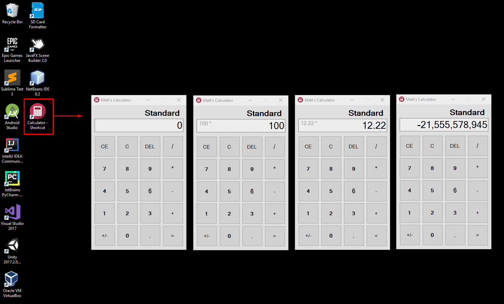

## Basic-Calculator
Basic calculator program for Windows desktops. 
At the moment there is only a "Standard" mode available. 

For the future I will be adding a mode menu so the user can switch between different calculator modes when they become available
(pretty much like how the Windows 10 calculator is).

## Future Implementations will have:
```
1) Tax mode
2) Scientific mode
3) Addition of other relevant buttons (i.e. percentages)
```

## Known Bugs/Notes
```
1) Numbers with more than sixteen digits appear off-screen on textfield.
2) Calculator window size is static (on purpose for now).
```

## Calculator Preview

